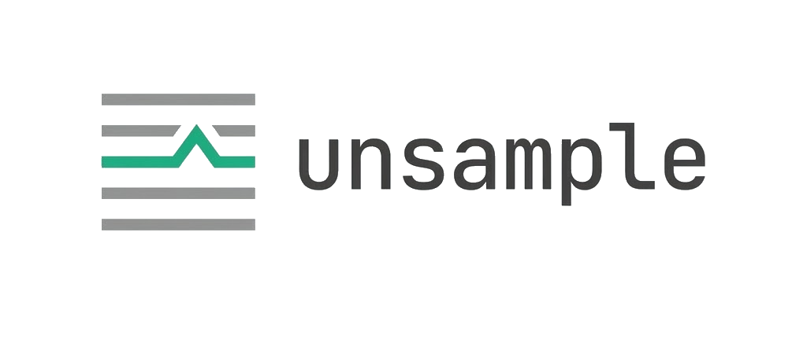
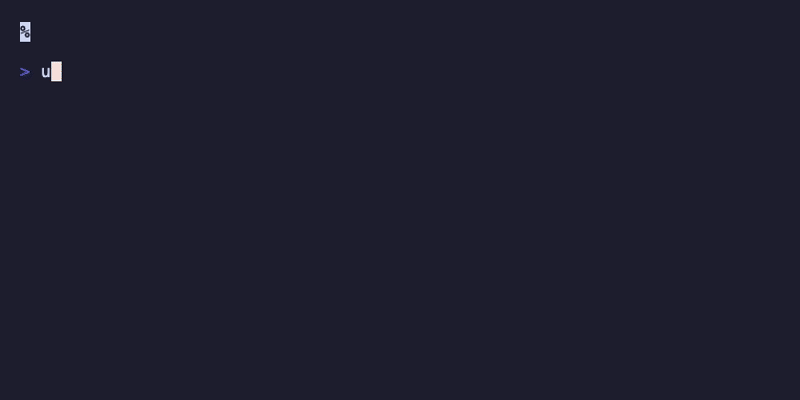

<p align="center">
  <picture>
    <source media="(prefers-color-scheme: dark)" srcset="docs/assets/logo-dark.png">
    <source media="(prefers-color-scheme: light)" srcset="docs/assets/logo-light.png">
    
  </picture>
</p>

<p align="center">
  <strong>On-demand debug tracing for OpenTelemetry.</strong><br/>
  Like a breakpoint, but for distributed systems.
</p>

<p align="center">
  <a href="LICENSE"></a>
</p>

<p align="center">
  <a href="docs/quickstart.md">Quickstart</a> · <a href="docs/cli-reference.md">CLI Reference</a> · <a href="docs/troubleshooting.md">Troubleshooting</a>
</p>

---

## The Problem

You sample 1% of traces in production. A user reports a bug. You check your tracing backend — the trace was dropped. You redeploy with `AlwaysSample`, drown in data, and still can't reproduce the exact request.

**Unsample** lets you capture 100% of spans for a single request — across every service in the call chain — without changing your sampling config.

<p align="center">
  
</p>

## Install

```bash
go install github.com/unsample/unsample/cmd/unsample@latest
```

## Getting Started

Add the SDK middleware to your service (2 lines):

```go
handler := otelhttp.NewHandler(
    unsample.Middleware(unsample.Config{
        Secret: os.Getenv("UNSAMPLE_SECRET"),
    })(mux),
    "my-service",
)
```

Run a debug request:

```bash
export UNSAMPLE_SECRET="your-shared-secret"
unsample debug 'http://localhost:8080/checkout?user=123'
```

Click the link → full trace in Grafana. See the [Quickstart Guide](docs/quickstart.md) for a complete walkthrough.

## How It Works

1. **CLI** signs an HMAC token, injects it as W3C baggage, and sends your request
2. **SDK middleware** verifies the token, overrides the sampler to 100%, and captures request/response bodies (truncated to 64KB)
3. **OTel Collector** routes `debug.trace=true` spans to a separate Tempo instance (cost-isolated, 7-day TTL)

Zero allocations on the hot path. 99.99% of requests exit in <10ns.

## Try the Demo

```bash
git clone https://github.com/lehan0328/unsample.git
cd unsample/examples/demo-app
docker-compose up --build -d

UNSAMPLE_SECRET=demo-secret-do-not-use-in-production \
  unsample debug 'http://localhost:8080/checkout?user=123'
```

## FAQ

<details>
<summary><strong>Does this add latency to production?</strong></summary>
No. The SDK check is 7.25ns with 0 allocations. Only debug requests pay the HMAC cost.
</details>

<details>
<summary><strong>What if my proxy strips baggage headers?</strong></summary>
Configure your proxy to forward the W3C <code>baggage</code> header. See <a href="docs/troubleshooting.md">Troubleshooting</a>.
</details>

<details>
<summary><strong>Can two developers debug simultaneously?</strong></summary>
Yes. Each session has a unique trace ID and token.
</details>

<details>
<summary><strong>What backends are supported?</strong></summary>
Any OTel-compatible backend. Tested with Grafana Tempo. The Collector can export to Jaeger, Datadog, Honeycomb, etc.
</details>

<details>
<summary><strong>Do I need to change my sampling config?</strong></summary>
No. Unsample overrides the sampler per-request at the SDK level.
</details>

## Documentation

| Doc | Description |
|---|---|
| [Quickstart](docs/quickstart.md) | Install → first trace in 5 minutes |
| [CLI Reference](docs/cli-reference.md) | Commands, flags, config file |
| [Troubleshooting](docs/troubleshooting.md) | Common issues and fixes |

## License

MIT — see [LICENSE](LICENSE).

If you find Unsample useful, give it a ⭐ — it helps others discover the project.
